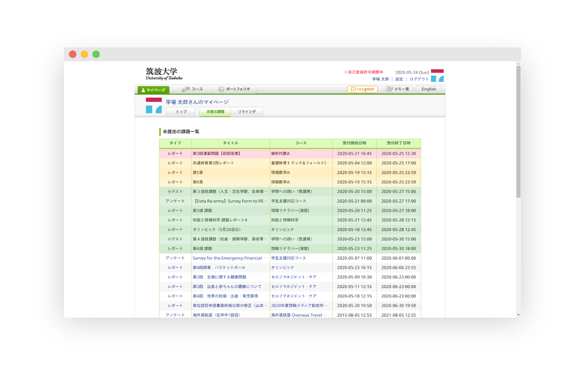

# manaba Enhanced for Tsukuba


<a href="https://codeclimate.com/github/mkobayashime/manaba-enhanced/maintainability"></a>

Make your manaba a little bit more comfortable.

Get it via [Chrome Web Store](https://chrome.google.com/webstore/detail/manaba-enhanced-for-tsuku/fldngcbchlbfgbccilklplmhljilhfch).

**For students of University of Tsukuba.**



## Supported Univ. / 対応大学

- University of Tsukuba / 筑波大学

If you want to use it in your univ., please follow the [instruction](https://github.com/mkobayashime/manaba-enhanced#how-to-add-support-for-your-univ) below.

## Features

1. Color assignments with colors according to the time remaining

   Red: 1 day remaining  
   Yellow: 3 days remaining  
   Green: 7 days remaining

1. Auto-save report text

1. Highlight the publication deadline of course news and course contents

1. Filter courses in mypage by terms/modules

1. Generate $\LaTeX$ template for reports

1. Drag & Drop file upload

1. Remove the confirmation dialogue of external links

1. Add a context menu to open the attend code in Respon

## 機能

1. 締め切りまでの時間による課題一覧の色分け

   赤: 期限まであと 1 日  
   黄: 期限まであと 3 日  
   緑: 期限まであと 7 日

1. レポート入力画面でのレポート自動保存

1. コースニュースやコンテンツの公開期限を強調表示

1. コースのモジュール別フィルタリング

1. レポートの $\LaTeX$ テンプレートを生成

1. ドラッグアンドドロップでのファイルアップロード

1. 外部リンククリック時の確認ダイアログ排除

1. 出席コードを Respon で開く右クリックメニューを追加

## Disclaimer / 免責事項

This is an unofficial software and has nothing to do with the administration of the University of Tsukuba.

We will not be held responsible for any damages and troubles caused by this software.

これは大学非公式のソフトウェアであり、筑波大学とは無関係です

私達はこのソフトウェアを利用したことによるいかなる損害、トラブルに対する責任を負いません

## Development

```sh
make # Install dependencies

make dev.chrome # Run in dev mode for Chrome
make dev.firefox # ...and for Firefox

make build.chrome # Production build for Chrome
make build.firefox # ...and for Firefox

make format # Run Prettier

make lint # Run ESLint

make typecheck # Run typecheck
```

## How to add support for your univ.

If your univ. is using manaba and there is _Assignments_ tab in the mypage, please follow the instruction below to use this extension.

1. Fork this repository.
1. Replace `matches` of `content_scripts` in `manifest.json` with the url of manaba of your univ..
1. Build and install in Chrome.

あなたの大学が manaba を導入しており、マイページに「未提出課題」タブが存在する場合、以下の手順で対応が可能です。

1. このレポジトリをフォークする。
1. `manifest.json`に記述されている`content_scripts`の`matches`をあなたの大学の manaba の URL に変更する。
1. ビルドし Chrome にインストールする。

## Contribution

Suggestions and pull requests are welcomed!

## License

[MIT License](./LICENSE)
